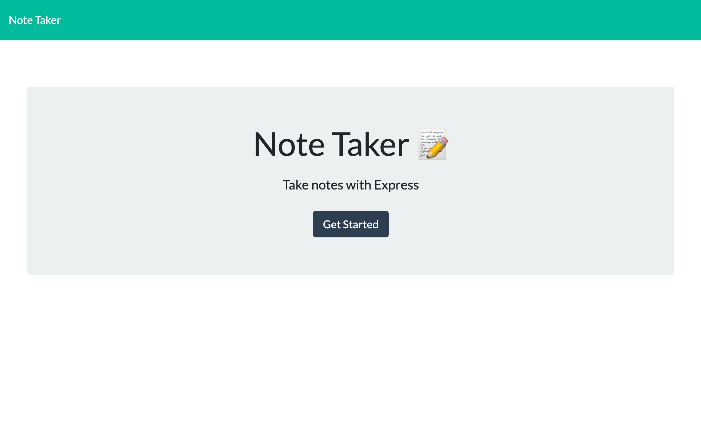
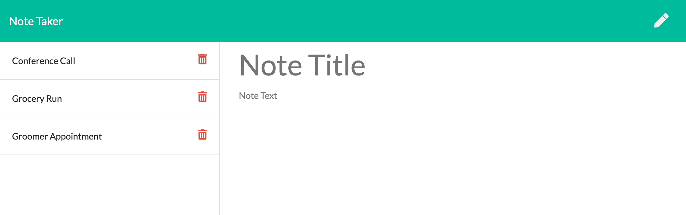

# Note-Taker

## Table of Contents
* [Description](#description)
* [Installation](#installation)
* [Usage](#usage)
* [License](#license)
* [Visuals](#visuals)
* [Deployed Application](#deployed)
* [Contributing](#contributing)
* [Support](#support)

## Description
Note-Taker is a simple application that can be used to write, save, and delete notes. It utilizes an Express backend featuring HTML and API routes diverting visitors to various pages dependent upon their request. This application makes the daily hassle of staying on track and organized a thing of the past! 

## Installation
This application requires the following node modules:
* Express
* Path
* FS

To install, run "npm install" in your Command Line System.

## Usage
To use this application, run "node server.js" in your Command Line System and navigate to the specified port in your web browser.

## License

## Visuals

## Deployed Application
https://still-bayou-46878.herokuapp.com/

## Contributing
Pull requests are welcome. For major changes, please open an issue first to discuss what you would like to change. 

## Support
For questions, comments or concerns regarding the Note-Taker application, please email barrettpope94@gmail.com.
